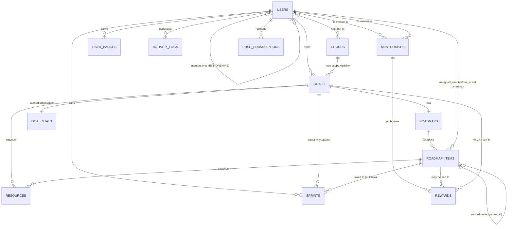

# Software Requirements Specification (SRS)
## Working name: **Pathforge** *(placeholder — rename freely, used for consistency across docs)*
### A personal/family goal, roadmap, and focus-tracking platform

Version 0.1 · Draft for engineering kickoff

---

## 1. Introduction

### 1.1 Purpose
This SRS defines what the system must do. It is the source of truth that `02-BACKEND-ARCHITECTURE.md` and `03-FRONTEND-ARCHITECTURE.md` implement, and that `04-BACKEND-STEPS.md` / `05-FRONTEND-STEPS.md` / `06-TESTING-STRATEGY.md` sequence and verify.

### 1.2 Scope
A web app where a small, closed group of people (you, your brothers, invited friends) each:
- Set personal **Goals** ("Learn C in 2 months").
- Build a **Roadmap** for a goal — either fully upfront or incrementally as they progress — broken into ordered, statusable items (days/topics/milestones).
- Run **Focus Sprints** (Pomodoro-style or custom-duration timers) against roadmap items to log actual time spent.
- Attach **Resources** (documents, links, notes) to goals or roadmap items.
- View **Analytics** on their own consistency, velocity, and projected finish date.
- **Compare** progress against other members of a shared Group (family/friends), with privacy controls.

### 1.3 Definitions
| Term | Meaning |
|---|---|
| Goal | Top-level objective with a target timeframe (e.g., "Learn C") |
| Roadmap | The ordered plan of steps belonging to one Goal |
| Roadmap Item | A single node in the roadmap (a day, topic, or milestone) with a status |
| Sprint | A timed focus session (Pomodoro/custom/stopwatch) optionally linked to a Roadmap Item |
| Group | A private circle of users (family/friends) who can see each other's shared goals |
| Streak | Consecutive days with at least one completed Sprint or Roadmap Item |

### 1.4 Research basis
Before designing, we looked at the closest existing products across three axes — *learning roadmaps*, *focus/Pomodoro timers*, and *habit/goal gamification with social comparison* — and took the mechanisms that map cleanly onto this project's actual use case (a family learning things together), while dropping mechanisms that don't (RPG combat, client billing, public community editing).

---

## 2. Competitive Landscape & Feature Provenance

| Product | What it does well | What we borrow | What we deliberately drop |
|---|---|---|---|
| **roadmap.sh** | Visual, node-based step-by-step learning paths; each node marked todo / in-progress / done / skipped; curated resources per node; AI-personalized paths | Node-based roadmap structure with **per-node status** and **attached resources**; the idea of a roadmap as a checklist you progressively fill in, not just a static plan | Public, community-editable roadmaps — ours are private to the owner or their Group |
| **Pomofocus** | Simple pomodoro timer, per-task pomodoro estimates, templates, visual daily/weekly/monthly reports, CSV export, weekly leaderboard | Customizable work/break intervals, **task-linked time estimates**, visual time reports, CSV export of session history | Its lack of any underlying task/roadmap hierarchy — Pomofocus tracks tasks in isolation, we roll sprint time up into roadmap items and goals automatically |
| **Toggl Track / Focused Work** | Multiple timer modes (countdown, Pomodoro, stopwatch); a timer anchored to a **wall-clock deadline** so it survives tab-switch, refresh, and app close without drifting; Work/Break/Planning session stages | Wall-clock-anchored timer resilience (critical UX detail most Pomodoro clones get wrong); multiple timer modes; floating/picture-in-picture timer | Billing/invoicing, team workspace administration — not relevant to a family app |
| **Habitica** | Streaks, XP/leveling, HP consequence for missed dailies, "parties" (small private groups) for social accountability | **Opt-in, lightweight** streaks/XP/badges; the "party" concept maps directly to our **Group** | Full RPG layer (combat, avatars, monster battles) — adds clutter for a studying-focused family app; several reviews cite this as a source of "gamification fatigue" |
| **GoalFlow** | "Squad Challenges" (friends race toward the same goal together); a **success-prediction score** derived from streak/velocity data rather than a fixed plan | The **projected-completion-date analytics** and **group challenge** structure — this is the actual differentiator for the "comparison with others" requirement | Its subscription/paywall model — not relevant to architecture |
| **Notion (goal/roadmap templates)** | Same underlying data viewable as Kanban, Timeline, or Table without duplication | **Multiple views over one roadmap** (Kanban view + Timeline/Gantt-ish view) so planners and improvisers both get a UI that fits how they think | Free-form database flexibility — we intentionally keep a fixed schema for reliable analytics |
| **Streaks (iOS)** | Minimal, elegant "chain" visualization; hard cap on habit count to avoid overwhelm | Clean heatmap/chain visual for daily consistency (GitHub-contribution-graph style) | Its native-only, single-device model |
| **Family chore/allowance apps (Homey, Privilege Points, GoHenry/Acorns Early)** | A parent defines rewards (cash or privileges) tied to tasks; kids **request** a reward and the parent reviews and approves or denies it — nothing auto-credits; an internal IOU/ledger tracks what's owed | The **request → approve/deny** flow (this is exactly the mechanism behind "demand rewards from mentors") and an internal **IOU ledger**, not a real payment integration | Real debit cards, bank-linked allowance transfers, prepaid card issuance — this app deliberately stays a bookkeeping/record layer; if real money changes hands, that happens outside the app, by hand or via the family's own banking, same as writing an IOU on a whiteboard |

### 2.1 The actual blend (what makes this app distinct)
A **Roadmap Item** is simultaneously:
1. A learning-path node (roadmap.sh) — has a status and attached resources.
2. A schedulable focus target (Pomofocus/Toggl) — Sprints attach to it and their time **rolls up automatically**: Sprint → Roadmap Item → Goal → Group leaderboard.
3. An input to **projection analytics** (GoalFlow) — "at your current pace, you'll finish this goal on March 3rd," computed from real velocity, not the original plan date.
4. **(see §4.7–4.8)** A potential trigger for a **Reward** that a chosen **Mentor** attached to it — closing the loop between "here's what I'm learning" and "here's what happens when I finish it," the way a chore chart connects a task to an allowance, except the task here is a real skill milestone instead of "take out the trash."

This is different from all of the above individually: roadmap.sh has no timer, Pomofocus has no roadmap hierarchy, Habitica's social layer isn't tied to real time-tracking data, GoalFlow has no node-based learning-path structure, and none of the chore/reward apps have any concept of a multi-week learning roadmap — they're built for recurring chores, not "learn C in two months."

---

## 3. Product Overview

### 3.1 Target users
Individual users organized into small, invite-only **Groups** (a family, a friend circle). No public/global social graph.

### 3.2 Personas
- **The Planner** — writes the full 2-month C roadmap on day one, day-by-day, then executes against it.
- **The Improviser** — starts a goal with just a title and adds roadmap items as they discover what to learn next.
- **The Sibling Spectator** — mostly checks the group leaderboard/comparison view to see how others are doing and get nudged into starting their own goal.

Both Planner and Improviser are first-class — the roadmap must support being built 100% upfront **or** incrementally (FR-RM-04).

### 3.3 Example end-to-end journey
1. User creates Goal "Learn C Programming", target 2 months.
2. User adds Roadmap Items day-by-day (or all 60 at once): "Day 1 – Variables & types", "Day 2 – Control flow", ... each with an estimated duration and optional resource links/files.
3. Each study session, the user opens the Goal, picks a Roadmap Item, and starts a Sprint (25-min Pomodoro or custom).
4. On completion, the Sprint's duration rolls up to the Roadmap Item (status auto-suggests "in progress" → user marks "done" when actually finished) and to the Goal's total focus time.
5. Dashboard shows streak, weekly heatmap, and "projected finish: in 54 days at current pace" vs. the 60-day plan.
6. In the family Group view, the user sees siblings' goals (those marked group-visible) and a leaderboard of weekly focus minutes / current streaks.

---

## 4. Functional Requirements

Priority key (MoSCoW): **M**ust, **S**hould, **C**ould, **W**on't (this release).

### 4.1 Authentication & Accounts
| ID | Requirement | Pri | Acceptance Criteria |
|---|---|---|---|
| FR-AUTH-01 | User can register with name/email/password | M | Account created, verification email sent (queued job) |
| FR-AUTH-02 | User can log in/out via Sanctum SPA (cookie) session | M | Session cookie issued; `/api/user` returns profile when authenticated |
| FR-AUTH-03 | Password reset via emailed token | M | Token expires in 60 min, single use |
| FR-AUTH-04 | User can update profile (name, avatar, timezone) | S | Timezone drives streak/day-boundary calculations |

### 4.2 Goals
| ID | Requirement | Pri | Acceptance Criteria |
|---|---|---|---|
| FR-GOAL-01 | Create a Goal with title, description, category, start/target-end date | M | Validated via Form Request; owner set from auth user |
| FR-GOAL-02 | Set Goal visibility: `private`, `group`, `public-to-group-members` | M | Group-visible goals appear in group comparison views only for group members |
| FR-GOAL-03 | Edit/archive/delete a Goal | M | Soft delete; archiving stops it counting toward active streak logic |
| FR-GOAL-04 | Mark a Goal complete manually, or auto-suggest completion when all roadmap items are done | S | Suggestion is a banner, not automatic — user confirms |
| FR-GOAL-05 | Goal categories (user-defined + a small seeded default set: Programming, Fitness, Language, Reading, Other) | C | — |

### 4.3 Roadmaps & Roadmap Items
| ID | Requirement | Pri | Acceptance Criteria |
|---|---|---|---|
| FR-RM-01 | Every Goal has exactly one Roadmap, created empty alongside the Goal | M | — |
| FR-RM-02 | Roadmap Items have: title, description, optional day number / scheduled date, estimated minutes, status (`todo`, `in_progress`, `done`, `skipped`), order position | M | Status changes are logged to activity feed |
| FR-RM-03 | Roadmap Items can be nested one level (topic → sub-topic) | C | Parent status is informational only, not auto-derived from children in v1 |
| FR-RM-04 | Roadmap Items can be added **all at once up front** or **incrementally over time** | M | No UI distinction required — "add item" is always available regardless of how many already exist |
| FR-RM-05 | Roadmap Items can be reordered via drag-and-drop | M | Persisted as an integer `position`; reorder endpoint updates a batch in one transaction |
| FR-RM-06 | Roadmap has at least two views over the same data: Timeline (day-ordered list) and Kanban (grouped by status) | S | Switching views does not lose selection/state |
| FR-RM-07 | Marking an item `done` prompts (optional) reflection note | C | — |

### 4.4 Focus Sprints
| ID | Requirement | Pri | Acceptance Criteria |
|---|---|---|---|
| FR-SPR-01 | Start a Sprint optionally linked to a Goal and/or Roadmap Item | M | A Sprint with no link is a "general focus session" |
| FR-SPR-02 | Timer modes: Pomodoro (custom work/break minutes), Countdown (fixed duration), Stopwatch (open-ended) | M | Defaults: 25/5 Pomodoro |
| FR-SPR-03 | The Sprint keeps running from the moment it's started **until the user explicitly stops it** — surviving page refresh, tab switch, background throttling, and **the browser being closed entirely (tab and window both), not just backgrounded** | M | Implemented by making the server the source of truth (a stored `started_at` + `planned_duration_seconds`), not a client-side countdown that stops existing the moment the tab does — see `02-BACKEND-ARCHITECTURE.md` §3 and `03-FRONTEND-ARCHITECTURE.md` §4. Reopening the app at any point recomputes elapsed/remaining time correctly from that timestamp, whether 30 seconds or 3 hours have passed. |
| FR-SPR-04 | Pause/resume a Sprint | S | Paused time excluded from `actual_duration_seconds` |
| FR-SPR-05 | On completion, Sprint duration rolls up to the linked Roadmap Item's `time_spent_seconds` and the Goal's aggregate | M | Handled by a queued recalculation job, not synchronously in the request |
| FR-SPR-06 | Sprint history list with filters (date range, goal, status) and CSV export | S | Mirrors Pomofocus's exportable report |
| FR-SPR-07 | One-click "start next sprint on this roadmap item" from the roadmap view | C | — |
| FR-SPR-08 | Prevent two simultaneously-running Sprints for the same user | M | Enforced server-side, not just client-side |
| FR-SPR-09 | A Sprint that reaches its planned duration does **not** auto-cancel or auto-complete — it enters an **overtime** state and keeps accumulating time until the user taps "stop"/"complete," matching "the pomodoro still working until the user clicks close on it" | M | Distinguish "reached planned duration" (a UI/notification event) from "session ended" (a user action); only a long-abandoned session (default 24h, configurable) is ever auto-cancelled by the cleanup job, as a crash-recovery safety net — not as a way to end a session the user simply hasn't gotten back to |
| FR-SPR-10 | When a Sprint reaches its planned duration while the app isn't open in an active tab, the user gets a **push notification** ("Your 25-minute session is done") so closing the site doesn't mean missing the alert | S | Uses the Web Push API (service worker + VAPID), which reliably reaches the user as long as their browser process is still running in the background — see the NFR caveat below on the one case (browser fully quit, not just tab-closed) where delivery is delayed until the browser is reopened, which is a platform limitation, not a bug in this app |

### 4.5 Resources / Documents
| ID | Requirement | Pri | Acceptance Criteria |
|---|---|---|---|
| FR-RES-01 | Attach files (PDF, docx, images, etc.) or links to a Goal or a Roadmap Item | M | Size/mime validated server-side; stored on configurable disk (local/S3) |
| FR-RES-02 | Attach freeform text notes to a Roadmap Item | S | — |
| FR-RES-03 | Preview supported file types inline (PDF/image); others download | C | — |

### 4.6 Groups & Social Comparison
| ID | Requirement | Pri | Acceptance Criteria |
|---|---|---|---|
| FR-GRP-01 | Create a Group and invite others via invite code or email | M | Invite code expires/regenerates; email invite sends a queued notification |
| FR-GRP-02 | Group members see each other's `group`-visibility Goals and their progress | M | Enforced by Policy, not just hidden in UI |
| FR-GRP-03 | Group leaderboard: weekly/monthly focus minutes, current streaks, goals completed | M | Cached (Redis, short TTL) — not recomputed on every page view |
| FR-GRP-04 | "Squad Challenge": two or more members commit to the same or parallel goals and see a shared progress comparison view | S | Inspired by GoalFlow; distinct from the leaderboard (leaderboard is passive, challenge is opt-in and goal-specific) |
| FR-GRP-05 | Leave/remove members; owner-only group settings | M | — |

### 4.7 Mentorship (roles as relationships, not a static field)
A deliberate design call, stated plainly rather than left implicit: **"mentor" is not a static role on the `users` table.** The same person is a mentor to their younger brother and an ordinary mentee on their own goals — a fixed `role` enum would force an awkward choice per user instead of modeling what's actually true, which is a **relationship between two specific people**. See `02-BACKEND-ARCHITECTURE.md` §3 for the resulting `mentorships` table.

| ID | Requirement | Pri | Acceptance Criteria |
|---|---|---|---|
| FR-MENT-01 | Any user can request another user as their mentor | M | Restricted to users who share at least one Group — this app has no public user directory/search, so "any user" in practice means "any user I already know through a shared Group," which is also the safer default for an app that may include minors |
| FR-MENT-02 | The requested mentor must accept before the relationship is active | M | Pending requests are visible to both sides; either side can withdraw/decline |
| FR-MENT-03 | A user may have multiple mentors, and be a mentor to multiple mentees, simultaneously | M | Many-to-many, not one-to-one |
| FR-MENT-04 | A mentor can view all of a mentee's goals and roadmaps, regardless of that goal's `visibility` setting | M | Mentorship is a separate, explicit grant of read access — not a side effect of Group membership, which only grants access to goals the owner marked `group`-visible |
| FR-MENT-05 | A mentor can set an **assigned time budget** and/or **due date** on a mentee's roadmap item | M | This is metadata layered on top of the mentee's own item — see FR-MENT-06 |
| FR-MENT-06 | A mentor **cannot** edit a mentee's roadmap item title, description, or mark it done on the mentee's behalf | M | Deliberate boundary: a mentor can set expectations (time, deadline) but the mentee still owns their own plan and their own claim of "I did this" — this avoids the mentor relationship quietly becoming the mentor's roadmap instead of the mentee's |
| FR-MENT-07 | Either party can end a mentorship at any time | M | Ending a mentorship does not retroactively revoke rewards already fulfilled |

### 4.8 Reward System
Modeled directly on the request → approve/deny pattern used by real chore/allowance apps (§2), including the finding that **auto-crediting is the wrong default** — every one of them puts a human approval step between "task done" and "reward delivered." This app is not a payments product: rewards are a bookkeeping/IOU layer, never an actual money transfer.

| ID | Requirement | Pri | Acceptance Criteria |
|---|---|---|---|
| FR-RWD-01 | A mentor can **offer** a reward tied to a specific Roadmap Item or Goal (title, description, type: monetary/privilege/custom, and an optional amount + label if monetary, e.g. "500 BDT" or "movie night") | M | Offering a reward requires an active mentorship with that mentee |
| FR-RWD-02 | When the linked Roadmap Item (or Goal) is marked done/completed, any `offered` reward tied to it automatically flips to **earned** | M | This is a status flip only — nothing is paid out automatically; see FR-RWD-05 |
| FR-RWD-03 | A mentee can **request** a reward that wasn't pre-offered — the literal "demand rewards from mentors" requirement | M | Creates a reward in `requested` status, notifies the mentor(s); the mentor can accept (converts to `offered`/`earned` as appropriate) or deny it |
| FR-RWD-04 | A mentee can **claim** an `earned` reward, notifying the mentor that it's time to deliver | M | This is the "demand" action for a reward the mentor already promised |
| FR-RWD-05 | A mentor marks a claimed reward **fulfilled** once actually delivered (in person, by bank transfer, however) | M | The app records that it happened; it does not move money — no payment processor integration, on purpose (see NFR below and Assumptions) |
| FR-RWD-06 | A running per-mentee-per-mentor **ledger** of fulfilled monetary rewards, so a parent doesn't have to remember what they still owe | S | Read-only summary, not a wallet — no balance is ever "spent" inside the app |
| FR-RWD-07 | A mentor can revoke an `offered` (not-yet-earned) reward, or deny a `requested` one, with an optional note | S | — |

### 4.9 Gamification (opt-in, lightweight)
| ID | Requirement | Pri | Acceptance Criteria |
|---|---|---|---|
| FR-GAM-01 | Daily streak counter per user (based on ≥1 completed Sprint or Roadmap Item that day) | M | Timezone-aware day boundary |
| FR-GAM-02 | XP awarded for completed Sprints/Roadmap Items; simple level curve | C | Toggleable off in user settings — some users find this noise, per research on "gamification fatigue" |
| FR-GAM-03 | Badges for milestones (7/30/100-day streak, first goal completed, etc.) | C | — |

### 4.10 Analytics
| ID | Requirement | Pri | Acceptance Criteria |
|---|---|---|---|
| FR-ANL-01 | Per-goal dashboard: completion %, total focus time, sessions count, streak, heatmap calendar | M | — |
| FR-ANL-02 | **Projected completion date**, computed from remaining estimated minutes ÷ recent average daily focus minutes | S | Recompute nightly + on-demand; show confidence as a range, not false precision |
| FR-ANL-03 | Cross-goal personal dashboard: time distribution by category, weekly trend | S | — |
| FR-ANL-04 | Group comparison charts (bar/line) for leaderboard metrics | S | — |

### 4.11 Notifications
| ID | Requirement | Pri | Acceptance Criteria |
|---|---|---|---|
| FR-NOT-01 | In-app notification center (Sprint reminders, streak-at-risk, group invites, challenge updates) | S | Backed by Laravel's built-in notifications table |
| FR-NOT-02 | Daily "streak at risk" reminder if no activity by a configurable hour | C | Queued, timezone-aware |

### 4.12 Admin
| ID | Requirement | Pri | Acceptance Criteria |
|---|---|---|---|
| FR-ADM-01 | Basic admin ability to view users/groups and disable abusive accounts | C | Not a full admin panel in v1 — a handful of protected routes is sufficient given the closed-group nature of the app |

---

## 5. Non-Functional Requirements

| Category | Requirement |
|---|---|
| **Security** | Sanctum-authenticated SPA; every mutating endpoint behind a Policy; Form Requests validate all input; mass-assignment protected via explicit `$fillable`/Resource shaping; file uploads validated by mime+size+extension; rate limiting on auth and sprint-start endpoints |
| **Performance** | Roadmap/goal list endpoints must avoid N+1 (eager-load items/resources counts); leaderboard/analytics queries cached (Redis) with short TTL, invalidated by the recalculation job |
| **Reliability** | Sprint timer must not lose time on refresh/backgrounding (client-side wall-clock anchoring); a crashed/abandoned Sprint auto-resolves via a scheduled cleanup job rather than hanging forever |
| **Scalability** | Stats/leaderboard recalculation is offloaded to Horizon queues, never computed synchronously in a request that a user is waiting on |
| **Privacy** | Visibility rules (`private`/`group`) enforced server-side in every query, not just hidden in the UI |
| **Accessibility** | WCAG AA color contrast; timer and roadmap builder fully keyboard-operable; status changes announced via `aria-live` for screen readers |
| **Portability** | Standard Laravel + MySQL + Vue stack, deployable to any VPS or PaaS; file storage abstracted via Laravel's filesystem so local vs. S3 is a config change |
| **Observability** | Horizon dashboard for queue health; structured logging on Sprint lifecycle and stats-recalculation failures |
| **Push notification delivery (honest caveat, not a guarantee)** | Web Push reaches the user even with the tab and window fully closed, **as long as the browser process itself is still running in the background** (true on Chrome/Firefox/Edge desktop by default, and reliable on Android via the OS regardless of browser state). If the browser process itself has been fully quit, the push is queued by the push service and delivered the next time the browser opens — it is not lost, but it is late. iOS only supports this at all if the app is installed to the home screen (iOS 16.4+); plain Safari-tab web push on iOS does not work. State this plainly in the UI's notification permission prompt rather than implying it always works instantly everywhere. |
| **Financial integrity of the Reward system** | The app is a bookkeeping/IOU layer, not a payments product — it never moves real money and never claims to. This is a scope boundary, not a missing feature: adding real payment rails would mean handling financial credentials and transfers, which is a materially different (and heavily regulated) product. |

---

## 6. Data Model Overview

Full column-level schema lives in `02-BACKEND-ARCHITECTURE.md`. High-level entity relationships:

---

## 6.1 Additional advanced features considered

Beyond what was explicitly asked for, here's a deliberate pass at "what else would genuinely help this specific app" — each judged against the actual use case (a family/friend circle, not a generic SaaS), not added reflexively:

| Idea | Verdict | Why |
|---|---|---|
| **PWA installability** ("Add to Home Screen") | **Should** | Directly strengthens the push-notification story (FR-SPR-10) — on Android and desktop it makes the app feel persistent rather than "a website"; on iOS it's the *only* way push notifications work at all. Low cost (a manifest + the service worker this already needs). |
| **Mentor "nudge"** — a one-tap encouragement notification a mentor can send a mentee (not tied to a reward) | **Could** | Cheap to build once notifications exist; matches the accountability-partner pattern from Focusmate/GoalFlow's squad challenges, adapted to an asymmetric mentor relationship instead of a peer one. |
| **Mentor dashboard** — one screen showing all mentees' streaks/progress at a glance | **Should** | A mentor with several mentees (a parent with three kids) shouldn't have to open each goal individually — this is a small, high-value addition once mentorship data exists. |
| **ICS/calendar export** of scheduled roadmap items and mentor-assigned due dates | **Could** | Was explicitly out-of-scope in the original draft; worth reconsidering now that mentors set real due dates — but still a genuine "could," since it's a nice-to-have layered on a feature (mentor assignment) that itself needs to prove out first. |
| **Reward "wishlist" / catalog** — a mentee can pre-propose reusable reward ideas a mentor can approve once and reuse | **Could** | Reduces repetitive typing for recurring rewards ("30 min extra screen time") without adding real complexity. |
| **Reminder if a claimed reward sits unfulfilled** | **Should** | The single biggest failure mode in every chore/reward app reviewed above is the parent forgetting to actually deliver — a gentle reminder to the mentor a few days after a claim directly targets that. |
| **AI-generated roadmap drafts** (à la roadmap.sh's AI Tutor) | **Won't (this release)** | Genuinely useful eventually, but it's a distinct, non-trivial subsystem (prompt design, cost, quality control) that would delay everything else here — stays a deliberate v2 idea, not folded in now. |
| **Native mobile app** | **Won't (this release)** | The PWA + push combination above covers most of what a native app would buy at a fraction of the build cost; revisit only if PWA install rates turn out to be low in practice. |

## 7. Out of Scope (v1)

- AI-generated roadmap suggestions (see §6.1 — a deliberate "Won't this release," not an oversight).
- Native mobile apps (see §6.1 — PWA + push covers most of the value at far lower cost).
- Real payment/bank integration for Rewards — the Reward system is bookkeeping only, by design (see the NFR above), not a phased-out feature.
- Public, non-group sharing of roadmaps or mentor discovery outside shared Groups — there is no public user directory in this app.

## 8. Assumptions

- Single first-party Vue SPA consuming the API — Sanctum **cookie-based SPA auth**, not token auth, since there's no separate mobile client in v1 (flagged as a tradeoff in `02-BACKEND-ARCHITECTURE.md` §2).
- MySQL 8+, single small VPS deployment target — no multi-region concerns.
- English-only UI for v1.
- "Group" is the correct model for "me and my brothers and other people" rather than a fully public social network — this materially simplifies the Policy layer and was treated as a firm assumption, not left open, because it changes the authorization design significantly.
- **Mentorship is scoped to shared Groups**, not open to any user by ID/email search — "any user can choose other user as mentors" is implemented as "any user I share a Group with," since there's no public directory and this app may include minors (see FR-MENT-01).
- **Rewards never move real money inside the app** — a mentor marking a reward "fulfilled" is a record of something that happened elsewhere (cash handed over, a bank transfer the family made on their own), not a transaction this app executes.
- **Web Push requires HTTPS in production** (a hard browser requirement, not a preference) — `localhost` is exempt for local development, but staging/production deployment needs a real TLS certificate before push notifications will work at all.
