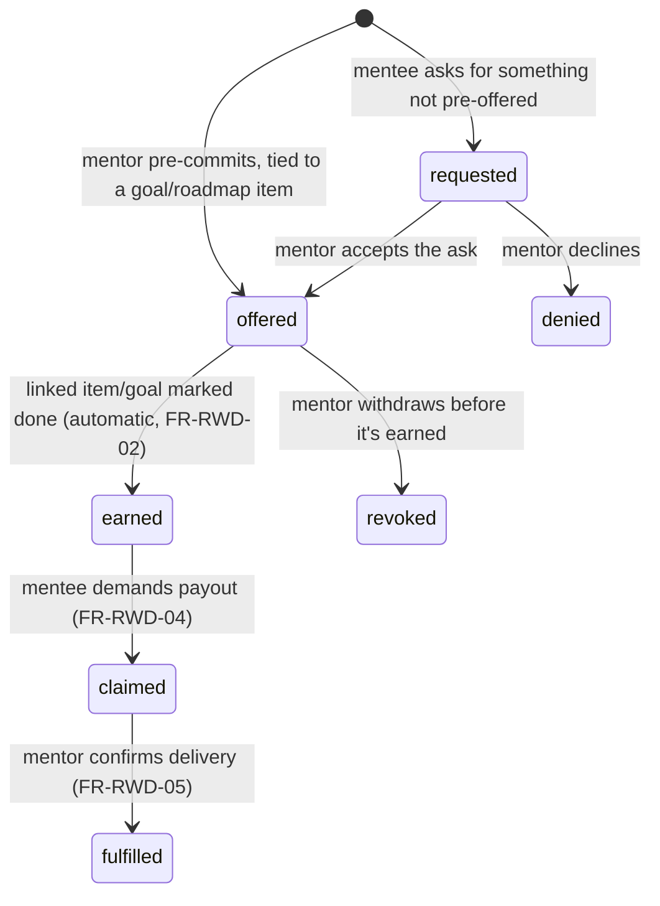

# Backend Architecture — Laravel 12 API

Companion to `01-SRS.md`. This defines the concrete implementation shape: schema, directory layout, routes, policies, queue jobs, caching, and package choices. `05-BACKEND-STEPS.md` sequences the build; this doc is the reference you build against.

---

## 1. Stack & API style

- **Laravel 12**, PHP 8.3+, MySQL 8.
- **`app.timezone` must stay `UTC`.** Every timestamp is stored in UTC and converted to the member's own `users.timezone` wherever a day boundary matters (streaks, history filters, projections). Setting a local zone here writes local time into the database, at which point converting a stored timestamp to a member's timezone is a no-op for members in the server's zone and wrong for everyone else — and every historical row silently changes meaning if the server ever moves. The default zone offered to a *new* member is a separate setting (`pathforge.default_timezone`).
- **Pure REST API** (not Inertia) — confirmed choice, since the frontend is a standalone Vue 3 SPA per your stack, not a Blade-hybrid app. This means: no session-shared page props, every boundary is a versioned JSON contract, and the Vue app owns all routing/state. Tradeoff: more boilerplate (Resources + TS types on both sides) vs. Inertia's "just pass props," but it buys a clean separation if you ever want a separate mobile client later.
- **Real-time: Laravel broadcasting over Pusher Channels**, one private channel per member. Live delivery is an additional channel on Laravel's existing notification system, not a parallel mechanism — see §10.
- **Auth: Laravel Sanctum, SPA cookie-based** (not personal access tokens). Justification: single first-party frontend served from a trusted domain → CSRF-protected cookie auth is simpler and more secure than juggling bearer tokens in JS storage. **Tradeoff flagged**: if a native mobile app is added later, that client will need token-based auth instead (Sanctum supports both), so keep the `AuthController` logic separable from "how the session is established."

---

## 2. Directory structure

```
app/
  Actions/
    Goals/CreateGoalAction.php
    Goals/CompleteGoalAction.php
    Roadmaps/CreateRoadmapItemAction.php
    Roadmaps/ReorderRoadmapItemsAction.php
    Roadmaps/AssignRoadmapItemAction.php        # mentor sets time budget/due date
    Sprints/StartSprintAction.php
    Sprints/CompleteSprintAction.php
    Sprints/CancelSprintAction.php
    Groups/InviteToGroupAction.php
    Groups/JoinGroupAction.php
    Mentorships/RequestMentorshipAction.php
    Mentorships/RespondToMentorshipAction.php   # accept/decline
    Mentorships/EndMentorshipAction.php
    Rewards/CreateRewardAction.php              # mentor offers
    Rewards/RequestRewardAction.php             # mentee "demands" one not yet offered
    Rewards/RespondToRewardRequestAction.php    # mentor accepts/denies a request
    Rewards/ClaimRewardAction.php               # mentee demands payout of an earned reward
    Rewards/FulfillRewardAction.php             # mentor confirms delivery
    Rewards/MarkRewardsEarnedForItemAction.php  # triggered on roadmap item/goal completion
  Services/
    StreakService.php
    ProjectionService.php        # projected-completion-date math
    LeaderboardService.php
    FileStorageService.php
  Http/
    Controllers/Api/
      AuthController.php
      GoalController.php
      RoadmapItemController.php
      ResourceController.php
      SprintController.php
      GroupController.php
      AnalyticsController.php
      NotificationController.php
      MentorshipController.php
      RewardController.php
      PushSubscriptionController.php
    Requests/
      StoreGoalRequest.php / UpdateGoalRequest.php
      StoreRoadmapItemRequest.php / ReorderRoadmapItemsRequest.php / AssignRoadmapItemRequest.php
      StartSprintRequest.php / CompleteSprintRequest.php
      StoreResourceRequest.php
      StoreGroupRequest.php / JoinGroupRequest.php
      RequestMentorshipRequest.php
      StoreRewardRequest.php / RequestRewardRequest.php / FulfillRewardRequest.php
      StorePushSubscriptionRequest.php
    Resources/
      GoalResource.php / GoalCollection.php
      RoadmapResource.php / RoadmapItemResource.php
      SprintResource.php
      ResourceFileResource.php   # "Resource" the model vs Laravel's Resource class — see naming note §3
      GroupResource.php / LeaderboardEntryResource.php
      GoalStatsResource.php
      MentorshipResource.php
      RewardResource.php
  Models/
    User.php, Group.php, GroupMember.php, Goal.php, Category.php,
    Roadmap.php, RoadmapItem.php, ResourceFile.php, Sprint.php,
    GoalStats.php, Streak.php, Badge.php, UserBadge.php, ActivityLog.php,
    Mentorship.php, Reward.php
  Policies/
    GoalPolicy.php, RoadmapItemPolicy.php, ResourceFilePolicy.php,
    SprintPolicy.php, GroupPolicy.php, MentorshipPolicy.php, RewardPolicy.php
  Jobs/
    RecalculateGoalStatsJob.php
    DailyStreakCheckJob.php
    CleanupStaleSprintsJob.php     # revised semantics — see §6
    NotifyExpiredSprintsJob.php    # NEW — push notification when a sprint hits its planned duration
    SendSprintReminderJob.php
    SendRewardClaimReminderJob.php # NEW — nudges a mentor about an unfulfilled claimed reward
  Notifications/
    MemberNotification.php           # abstract base — declares the channel set, see §10
    GroupInviteNotification.php
    StreakAtRiskNotification.php
    ChallengeUpdateNotification.php
    MentorshipRequestedNotification.php
    MentorshipAcceptedNotification.php
    RoadmapItemAssignedNotification.php
    RewardOfferedNotification.php
    RewardEarnedNotification.php
    RewardClaimedNotification.php
    RewardFulfilledNotification.php
    SprintCompleteNotification.php   # push channel — see §6
```

```
routes/
  api.php          # /api/v1 — every HTTP endpoint
  channels.php     # broadcast channel authorization — see §10
  console.php      # the schedule (§6)
```

> **Naming note**: the domain model "Resource" (an attached file/link/note) collides with Laravel's `Http\Resources` concept. We name the Eloquent model `ResourceFile` to avoid confusion — flag this in code review if anyone reintroduces `Resource.php`.

---

## 3. Database schema

All tables use `id() ` (bigint), `timestamps()`, and soft deletes where noted. FKs use `cascadeOnDelete()` unless stated.

### users
| Column | Type | Notes |
|---|---|---|
| name, email (unique), password | standard | |
| avatar_path | string, nullable | |
| timezone | string, default `UTC` | drives streak day-boundary |
| xp, level | unsignedInteger, default 0/1 | gamification, nullable feature |
| settings | json, nullable | e.g. `{ "gamification_enabled": true }` |

### groups
| Column | Type | Notes |
|---|---|---|
| owner_id | FK → users | |
| name | string | |
| invite_code | string, unique | regenerable |

### group_members
| Column | Type | Notes |
|---|---|---|
| group_id, user_id | FKs | unique composite |
| role | enum(`owner`,`member`) | |

### categories
| Column | Type | Notes |
|---|---|---|
| user_id | FK, nullable | null = global seeded category |
| name, icon | string | |

### goals
| Column | Type | Notes |
|---|---|---|
| user_id | FK → users | |
| category_id | FK, nullable | |
| group_id | FK, nullable | which group this is visible to, if `visibility = group` |
| title, description | string/text | |
| status | enum(`draft`,`active`,`paused`,`completed`,`abandoned`), default `active` | |
| visibility | enum(`private`,`group`), default `private` | |
| target_start_date, target_end_date | date, nullable | |
| completed_at | timestamp, nullable | |
| soft deletes | | archiving = `deleted_at` set, not hard delete |

### roadmaps
| Column | Type | Notes |
|---|---|---|
| goal_id | FK → goals, unique | 1:1 per FR-RM-01 |
| title | string, default "Roadmap" | |

### roadmap_items
| Column | Type | Notes |
|---|---|---|
| roadmap_id | FK → roadmaps | |
| parent_id | FK → roadmap_items, nullable | one level of nesting (FR-RM-03) |
| title, description | string/text | |
| day_number | unsignedSmallInteger, nullable | |
| scheduled_date | date, nullable | |
| estimated_minutes | unsignedInteger, nullable | |
| time_spent_seconds | unsignedInteger, default 0 | **denormalized rollup**, updated by `RecalculateGoalStatsJob` — never written directly by a controller |
| status | enum(`todo`,`in_progress`,`done`,`skipped`), default `todo` | |
| position | unsignedInteger | drives ordering; updated via batch reorder endpoint |
| reflection_note | text, nullable | FR-RM-07 |
| assigned_by_mentor_id | FK → users, nullable | who set the fields below — null means the mentee's own `estimated_minutes`/`scheduled_date` stand unmodified |
| assigned_minutes | unsignedInteger, nullable | a mentor's expected time budget for this item, **distinct from** `estimated_minutes` (the mentee's own estimate) — see FR-MENT-05/06: a mentor can set this, never the mentee's own fields |
| assigned_due_at | datetime, nullable | a mentor's deadline for this item |

Index: `(roadmap_id, position)`.

> **Why two "how long will this take" fields**: `estimated_minutes` is the mentee's own plan; `assigned_minutes` is what a mentor expects. They're allowed to disagree — that disagreement is useful information, not a bug to reconcile. Don't collapse these into one column.

### resource_files
| Column | Type | Notes |
|---|---|---|
| resourceable_type, resourceable_id | morphs | polymorphic → `Goal` or `RoadmapItem` |
| uploaded_by | FK → users | |
| type | enum(`file`,`link`,`note`) | |
| title | string | |
| url | string, nullable | for `link` type |
| disk, path, mime_type, size_bytes | nullable | for `file` type |
| body | text, nullable | for `note` type |

> If using `spatie/laravel-medialibrary` (see §7), the file-storage columns above are superseded by its own `media` table — decide before writing migrations, don't run both.

### sprints
| Column | Type | Notes |
|---|---|---|
| user_id | FK → users | |
| goal_id | FK, nullable | |
| roadmap_item_id | FK, nullable | |
| mode | enum(`pomodoro`,`countdown`,`stopwatch`) | |
| planned_duration_seconds | unsignedInteger, nullable | null for stopwatch |
| break_seconds | unsignedInteger, default 0 | |
| started_at | timestamp | |
| ended_at | timestamp, nullable | |
| paused_at | timestamp, nullable | when the *current* pause began, cleared on resume/complete. **Added during Phase 2**: FR-SPR-04 cannot be implemented without it — excluding paused time from `actual_duration_seconds` requires knowing when the open pause started, and deriving that from `updated_at` breaks the moment any other column on the row is written |
| paused_seconds_total | unsignedInteger, default 0 | closed pauses only; the open one is folded in on resume or completion |
| actual_duration_seconds | unsignedInteger, nullable | set on completion |
| status | enum(`running`,`paused`,`completed`,`cancelled`), default `running` | |
| notes | text, nullable | |
| notified_expired_at | timestamp, nullable | set by `NotifyExpiredSprintsJob` the first (and only) time a push notification is sent for this sprint reaching its planned duration — prevents re-notifying every minute while the user is in "overtime" (FR-SPR-09) |

Constraint (app-level, enforced in `StartSprintAction`, FR-SPR-08): a user may have at most one `running`/`paused` sprint at a time.

> **Overtime is not a new status.** A sprint whose `started_at + planned_duration_seconds` has passed but is still `running` is simply "running, past its planned duration" — the frontend renders this as an overtime state (FR-SPR-09), but nothing in the database changes just because the deadline passed. Only an explicit `complete`/`cancel` action changes `status`. Don't be tempted to add an `overtime` enum value — it's a derived UI concept, not a distinct data state, and adding it would just create a state you have to keep in sync with a timestamp comparison you're already doing anyway.

### goal_stats  *(materialized cache, not source of truth)*
| Column | Type | Notes |
|---|---|---|
| goal_id | FK, unique | |
| total_focus_seconds | unsignedInteger | |
| sessions_count | unsignedInteger | |
| completion_percentage | decimal(5,2) | `done / (total − skipped) × 100`, rounded to 2dp; 0 when the roadmap is empty. **Skipped items leave the denominator rather than counting as unfinished** — counting them would cap any roadmap containing a skipped item below 100% forever, so the FR-GOAL-04 completion banner could never appear for it. Nested items each count once and on their own, since FR-RM-03 makes a parent's status informational rather than derived |
| current_streak, longest_streak | unsignedInteger | **per goal**, in the owner's timezone. The per-*user* streak that FR-GAM-01 and the leaderboard need is a separate concern and arrives in Phase 3 alongside `DailyStreakCheckJob`; §2's `Streak.php` model belongs to that phase, not this one |
| projected_completion_date | date, nullable | via `ProjectionService` |
| last_recalculated_at | timestamp | |

### badges / user_badges
Standard lookup + pivot; seeded badges (`streak_7`, `streak_30`, `streak_100`, `first_goal_completed`).

### activity_logs
| Column | Type | Notes |
|---|---|---|
| user_id | FK | |
| subject_type, subject_id | morphs | Goal / RoadmapItem / Sprint |
| action | string | e.g. `roadmap_item.completed` |
| meta | json, nullable | |

Notifications table: Laravel's built-in `notifications` migration (polymorphic, no custom table needed).

### mentorships
| Column | Type | Notes |
|---|---|---|
| mentor_id, mentee_id | FK → users | a user can appear as `mentor_id` in one row and `mentee_id` in another — no role flag on `users` itself, see FR-MENT intro in `01-SRS.md` §4.7 |
| requested_by_user_id | FK → users | either the prospective mentor or mentee can initiate — this records who, so the UI can show "waiting on the other person" correctly |
| status | enum(`pending`,`accepted`,`declined`,`ended`), default `pending` | |
| responded_at | timestamp, nullable | |

Unique constraint on `(mentor_id, mentee_id)` — re-requesting after an `ended` relationship reuses the same row (update, don't insert a duplicate) to keep history in one place.

### rewards
| Column | Type | Notes |
|---|---|---|
| mentorship_id | FK → mentorships | authorizes the reward — you can't offer/request a reward outside an accepted mentorship |
| goal_id | FK → goals, nullable | |
| roadmap_item_id | FK → roadmap_items, nullable | a reward should be tied to at least one of `goal_id`/`roadmap_item_id` — enforced in `StoreRewardRequest`, not at the DB level, since "at least one of two nullable columns" isn't cleanly expressible as a single Laravel migration constraint |
| title, description | string/text | |
| type | enum(`monetary`,`privilege`,`custom`) | |
| monetary_amount | decimal(10,2), nullable | only meaningful when `type = monetary` |
| currency_label | string, nullable | free text ("BDT", "USD", or a non-currency label) — deliberately not a strict ISO-currency enum, since a lot of real rewards are "movie night," not money |
| status | enum(`requested`,`offered`,`earned`,`claimed`,`fulfilled`,`denied`,`revoked`), default `offered` | see the state diagram below — `requested` is the mentee-initiated entry point, everything else flows from a mentor `offered` reward |
| requested_by | enum(`mentor`,`mentee`) | who created the row — mirrors `mentorships.requested_by_user_id`'s purpose |
| claimed_at, fulfilled_at | timestamp, nullable | |
| fulfilled_note | text, nullable | e.g. "paid in cash, Aug 20" |



### push_subscriptions
Prefer the migration shipped by `laravel-notification-channels/webpush` (see §9) over hand-rolling this — it already matches the shape the package's `WebPushChannel` expects (`endpoint`, `public_key`, `auth_token`, `content_encoding`, keyed to a `subscribable` polymorphic relation, typically `User`). Don't create a second, slightly-different table by hand.

---

## 4. API routes (`routes/api.php`, all under `auth:sanctum` except auth entry points)

| Method | URI | Controller@method | Policy check |
|---|---|---|---|
| POST | `/register` | AuthController@register | — |
| POST | `/login` | AuthController@login | — |
| POST | `/logout` | AuthController@logout | authenticated |
| GET | `/user` | AuthController@me | authenticated |
| GET/POST | `/goals` | GoalController@index/store | `viewAny`/`create` |
| GET/PUT/DELETE | `/goals/{goal}` | GoalController@show/update/destroy | `view`/`update`/`delete` |
| POST | `/goals/{goal}/complete` | GoalController@complete | `update` |
| GET | `/goals/{goal}/stats` | AnalyticsController@goalStats | `view` |
| GET/POST | `/roadmaps/{roadmap}/items` | RoadmapItemController@index/store | via goal ownership/group |
| PUT/DELETE | `/roadmap-items/{item}` | RoadmapItemController@update/destroy | `update`/`delete` |
| POST | `/roadmaps/{roadmap}/items/reorder` | RoadmapItemController@reorder | `update` on roadmap's goal |
| PATCH | `/roadmap-items/{item}/assign` | RoadmapItemController@assign | `assign` (mentor of the item's goal owner only — see MentorshipPolicy) |
| GET/POST | `/goals/{goal}/resources` | ResourceController@index/store | `view`/`update` |
| GET/POST | `/roadmap-items/{item}/resources` | ResourceController@indexForItem/storeForItem | `view`/`update` |
| DELETE | `/resources/{resource}` | ResourceController@destroy | `delete` |
| POST | `/sprints/start` | SprintController@start | `create` |
| POST | `/sprints/{sprint}/pause` \| `/resume` \| `/complete` \| `/cancel` | SprintController@* | `update` (owner only) |
| GET | `/sprints` | SprintController@index | scoped to `auth()->id()` — filters: `from`/`to` (resolved in the member's own timezone), `goal_id`, `roadmap_item_id`, `status` |
| GET | `/sprints/active` | SprintController@active | scoped to `auth()->id()` — the single running-or-paused sprint, or `data: null`. This is what the SPA calls on bootstrap to recover a session started before the browser was closed (FR-SPR-03); "nothing running" is a normal state, so it is `null` rather than a 404 |
| GET | `/sprints/export` | SprintController@export | scoped to `auth()->id()` — CSV, FR-SPR-06 |
| GET/POST | `/groups` | GroupController@index/store | — |
| GET | `/groups/{group}` | GroupController@show | `view` (member only) |
| POST | `/groups/{group}/invite` | GroupController@invite | `update` (owner only) |
| POST | `/groups/join` | GroupController@join | — (takes invite code) |
| GET | `/groups/{group}/leaderboard` | AnalyticsController@leaderboard | `view` |
| GET | `/analytics/overview` | AnalyticsController@overview | scoped to self |
| GET | `/notifications` | NotificationController@index | scoped to self |
| PATCH | `/notifications/{id}/read` | NotificationController@markRead | scoped to self |
| GET/POST | `/mentorships` | MentorshipController@index/store | index scoped to self (as mentor or mentee); store requires shared Group (FR-MENT-01) |
| POST | `/mentorships/{mentorship}/accept` \| `/decline` \| `/end` | MentorshipController@* | only the non-initiating party can accept/decline; either can end |
| GET/POST | `/rewards` | RewardController@index/store | index scoped to self (as mentor or mentee); store = mentor offering, requires `accepted` mentorship |
| POST | `/rewards/request` | RewardController@request | mentee-initiated "demand," FR-RWD-03 |
| POST | `/rewards/{reward}/respond` | RewardController@respond | mentor accepts/denies a `requested` reward |
| POST | `/rewards/{reward}/claim` | RewardController@claim | mentee only, requires `earned` status, FR-RWD-04 |
| POST | `/rewards/{reward}/fulfill` | RewardController@fulfill | mentor only, requires `claimed` status, FR-RWD-05 |
| POST | `/rewards/{reward}/revoke` | RewardController@revoke | mentor only, requires `offered` status (not yet earned) |
| POST | `/push-subscriptions` | PushSubscriptionController@store | authenticated — stores the browser's push subscription for the current user |
| DELETE | `/push-subscriptions` | PushSubscriptionController@destroy | authenticated — called when the user disables notifications client-side |
| GET/POST | `/broadcasting/auth` | *(framework)* `Illuminate\Broadcasting\BroadcastController@authenticate` | authenticated — private-channel authorization for Pusher, see §10. Mounted inside this versioned, stateful API group rather than on the framework's default `web` group, so the separate-origin SPA can reach it with the same session cookie and CORS rules as every other call |

**Controllers stay thin**: every controller method is `validate → call an Action/Service → return a Resource`. No query building, no business logic in the controller body — that's what `app/Actions` and `app/Services` are for, per your stated default.

---

## 5. Authorization (Policies)

- `GoalPolicy`: `view` → owner OR (`goal.visibility === 'group'` AND viewer is a member of `goal.group_id`) OR (viewer has an `accepted` mentorship with the owner — FR-MENT-04, a **separate** grant from Group visibility, checked independently, not folded into the same branch). `update`/`delete` → owner only, full stop — a mentor never gets `update`.
- `RoadmapItemPolicy`: `view`/`update`/`delete` delegate to the parent Goal's policy (a roadmap item is never independently more permissive than its goal). New ability `assign` → true only if the requesting user has an `accepted` mentorship where they are `mentor_id` and the item's goal belongs to that mentee — deliberately a *different* ability from `update`, so granting `assign` can never accidentally also grant edit/delete rights over the item's own content (FR-MENT-06).
- `ResourceFilePolicy`: delegates to whichever parent (`Goal` or `RoadmapItem`) it's attached to.
- `SprintPolicy`: owner only, full stop — sprints are never group-visible directly, and a mentor does **not** get to see or control a mentee's sprints; only their *aggregated* time appears in leaderboards and in whatever the mentor sees via `GoalPolicy::view`'s roadmap/stats data.
- `GroupPolicy`: `view` → member. `update` (invite, remove members, rename) → owner only.
- `MentorshipPolicy`: `create` → true only if the target user shares at least one Group with the requester (FR-MENT-01) — checked in the Action, not just the Form Request, since it's a real authorization rule, not input validation. `view` → either party. `respond` (accept/decline) → only the party who did **not** initiate. `end` → either party.
- `RewardPolicy`: `create` (mentor offering) → requires an `accepted` Mentorship between the acting user (as mentor) and the target mentee. `request` (mentee demanding something new) → requires an `accepted` Mentorship where the acting user is the mentee. `respond` (accept/deny a request) → mentor side only. `claim` → mentee side only, and only when `status === 'earned'`. `fulfill`/`revoke` → mentor side only.

**Security flags to enforce in code review**: mass-assignment — every model uses explicit `$fillable`, never `$guarded = []`; every Resource explicitly lists returned fields (never `return $model` raw) so `time_spent_seconds`, `xp`, internal IDs of *other users'* records aren't accidentally leaked through a relation; file upload validation checks both MIME type and a byte-content sniff (`finfo`), not just the extension.

---

## 6. Queue jobs (Horizon)

| Job | Trigger | Responsibility |
|---|---|---|
| `RecalculateGoalStatsJob` | Dispatched after Sprint completion, Roadmap Item status change | Recompute `goal_stats` row: rolls sprint time into `roadmap_items.time_spent_seconds` and the goal aggregate, recalculates `completion_percentage`, calls `ProjectionService` for `projected_completion_date`, updates `StreakService` state, and calls `MarkRewardsEarnedForItemAction` for the changed item/goal (FR-RWD-02). **Debounced**: use a unique job (`ShouldBeUnique`) keyed by `goal_id` so rapid successive sprint-completes don't queue redundant recalculations. |
| `DailyStreakCheckJob` | Scheduled daily (per-user timezone via a scheduled command that fans out) | Evaluate whether yesterday had qualifying activity; increment/reset `current_streak`; dispatch `StreakAtRiskNotification` if today isn't done yet and it's past the user's configured reminder hour |
| `NotifyExpiredSprintsJob` | Scheduled every minute | Finds `running` sprints where `started_at + planned_duration_seconds` has just passed and `notified_expired_at` is still null; sends a push notification (FR-SPR-10) via the `SprintCompleteNotification`'s webpush channel; sets `notified_expired_at` so it never re-fires for the same sprint. **Does not touch `status`** — see the overtime note in §3. This is the job that makes "still working until the user clicks close on it" actually true: reaching the deadline triggers a notification, not a state change. |
| `CleanupStaleSprintsJob` | Scheduled hourly | **Revised from a naive "past planned duration" check**: only auto-`cancel`s a `running`/`paused` sprint that's been abandoned for a long grace period (default 24h, configurable) — this is a crash-recovery safety net for a genuinely dead browser tab/session, not a way to end a session the user is intentionally still running past its planned duration (FR-SPR-09). Getting this grace period wrong in the "too short" direction directly breaks the "closed website" requirement — a sprint auto-cancelled after, say, 90 minutes because someone stepped away would be exactly the bug this feature exists to prevent. |
| `SendSprintReminderJob` | Scheduled, opt-in | Notify user if no sprint started by a configured time |
| `SendRewardClaimReminderJob` | Scheduled daily | Nudges a mentor about a `claimed` reward that's been sitting unfulfilled for more than a few days (default 3, configurable) — directly targets the most common real-world failure mode found in the chore/reward app research (§2 of `01-SRS.md`): the parent forgetting to actually deliver |

Every notification these jobs send extends `MemberNotification` and is therefore `ShouldQueue`, which means the Pusher round-trip also happens on the queue (§10). A job that dispatches a notification must not treat a broadcast failure as a job failure — the durable row is already written by then.

Why queued, not synchronous: stats recalculation touches multiple tables and must never block the HTTP response the user is waiting on after finishing a sprint (NFR: performance). This is also why `goal_stats` exists as a separate cache table instead of computing aggregates with `withSum`/`withCount` on every request — those queries are fine for one goal, expensive for a leaderboard across a whole group.

---

## 7. Caching

- **Leaderboard queries** (`AnalyticsController@leaderboard`): Redis cache key `leaderboard:{group_id}:{period}`, TTL 5 minutes, invalidated explicitly when `RecalculateGoalStatsJob` runs for any member of that group (rather than waiting for TTL expiry, to keep it feeling live without recomputing on every request).
- **`goal_stats`** table itself *is* the cache for per-goal analytics — controllers read it directly, never recompute live.

---

## 8. File storage

- Laravel `Storage` filesystem abstraction: `local` disk in dev, S3-compatible (`s3` driver, works with AWS S3, DigitalOcean Spaces, Cloudflare R2) in staging/prod — a config change, not a code change.
- Uploaded resource files validated in `StoreResourceRequest`: allow-list of MIME types (pdf, common image types, docx/pptx/xlsx, plain text, zip **excluded** — zips are a common malware vector and there's no stated need for them), max size (e.g. 25 MB, configurable), and a `finfo`-based content check to catch spoofed extensions.

---

## 9. Suggested packages (beyond what's already in your stack)

| Package | One-line justification |
|---|---|
| `spatie/laravel-medialibrary` | Polymorphic file attachment (Goal/RoadmapItem) with disk abstraction and automatic conversions (e.g., thumbnailing images) — reinventing this by hand for `resource_files` is a lot of edge-case handling for something this package already solves well. **Alternative**: hand-rolled `resource_files` table as scoped above, if you'd rather avoid the dependency — both are viable, pick one before Phase 2. |
| `league/csv` | Clean, well-tested CSV writer for the Sprint history export (FR-SPR-06) — avoids hand-building CSV escaping. |
| `spatie/laravel-activitylog` *(optional)* | Could replace the hand-rolled `activity_logs` table if you want built-in diff/causer tracking; the hand-rolled version above is simpler and sufficient for v1's needs, so treat this as a "nice to have, not needed."|
| `pusher/pusher-php-server` | Server SDK behind Laravel's `pusher` broadcast driver, which is what delivers FR-NOT-03. Required — the driver is a thin wrapper and does not work without it. See §10 for why a hosted service is preferred over self-hosting Reverb at this scale. |
| `laravel-notification-channels/webpush` | Adds a `WebPushChannel` to Laravel's existing notification system and ships the `push_subscriptions` migration — this is the standard, well-maintained wrapper around `minishlink/web-push` for PHP; hand-rolling VAPID signing and the Web Push protocol's payload encryption yourself is a lot of cryptography to get subtly wrong for no benefit over an existing library. Requires generating a VAPID key pair (`php artisan webpush:vapid`) and, in production, a real HTTPS certificate — push subscriptions silently fail to register over plain HTTP outside of `localhost`. |

No package is suggested for the Actions pattern (e.g. `lorisleiva/laravel-actions`) — plain invokable classes under `app/Actions` give you the same organizational benefit without a dependency, and that's already your stated default.

---

## 10. Real-time delivery (Pusher Channels)

Implements FR-NOT-03. **Broadcasting is a third channel on Laravel's existing notification system, not a second notification system.** There is one payload, defined once, and three ways it can reach a member.

### 10.1 The three channels, and why none of them is redundant

| Channel | Reaches | Cannot reach |
|---|---|---|
| `database` | Everyone, eventually. The durable record behind FR-NOT-01. | Nobody in real time. |
| `broadcast` (Pusher) | An open tab, focused or backgrounded, instantly. | A page that no longer exists. |
| `webpush` (VAPID) | A member whose tab and window are both closed (FR-SPR-10). | Costs an OS-level interruption, so it is opted into per notification, never default. |

`database` and `broadcast` are on **every** member notification. `webpush` is added only by notifications worth interrupting someone for — a sprint hitting its planned duration, a reward being claimed, a mentorship request.

The ordering matters: the durable row is written first. Broadcasting is queued and best-effort, so a Pusher outage degrades the app to "not live," never to "notification lost."

### 10.2 The base class

`App\Notifications\MemberNotification` is abstract and owns the channel decision, so no individual notification can get it wrong:

- `via()` returns `['database', 'broadcast']`, plus `WebPushChannel::class` when the subclass overrides `reachesClosedBrowser()` to return `true`.
- `toArray()` is abstract and is the **single** source of the payload — the database row, the broadcast frame, and the SPA's `Notification` type all read the same shape, so a live frame and a later reload of the notification centre can never disagree.
- `broadcastType()` returns `class_basename($this)`, so the wire format carries `RewardEarnedNotification`, not a PHP FQCN. Without this the SPA would be coupled to backend namespaces.
- `toBroadcast()` nests the payload under a `payload` key, alongside `read_at` and `created_at`. Two reasons, both learned the hard way:
  1. Laravel merges `id` and `type` into the broadcast frame. A flat payload lets any notification's own field silently shadow one of them.
  2. `data` is Laravel's API-resource wrapper key. A top-level `data` field makes `JsonResource` believe the body is already wrapped and silently drop the envelope — which is why `NotificationResource` exposes `payload` too, and the two shapes stay identical field-for-field.

### 10.3 Channels and authorization

Channel authorization is a privacy boundary in its own right, ranking alongside the Policies in §5: a member who can subscribe to another member's channel receives their notifications live no matter what any Policy says. Every channel is private and every callback returns a hard boolean.

| Channel | Authorized when | Added in |
|---|---|---|
| `App.Models.User.{id}` | `$user->id === (int) $id`. This is the channel Laravel's own `broadcast` notification channel targets, so authorizing it is what makes the notification centre live. | Cross-cutting (Phase 1) |
| `groups.{group}` | Acting user is a member — mirrors `GroupPolicy::view`. Carries leaderboard and Squad Challenge updates. | Phase 3 |
| `mentorships.{mentorship}` | Acting user is either party on an `accepted` row — mirrors `MentorshipPolicy::view`. Carries reward state-machine transitions. | Phase 4 |

A channel is added when something actually broadcasts on it, not in advance.

> **Trap worth knowing**: `Broadcast::channel()` registers against the *current broadcaster instance*, not against config. Swapping `broadcasting.default` after the app has booted leaves the new instance with **no channels at all**, and a broadcaster with no channels rejects everything — which looks exactly like a broken authorization rule. Any test that switches the driver has to re-require `routes/channels.php`.

### 10.4 Configuration

- `BROADCAST_CONNECTION=pusher`; `PUSHER_APP_ID`, `PUSHER_APP_KEY`, `PUSHER_APP_SECRET`, `PUSHER_APP_CLUSTER` in `.env` only — the secret is a server credential and never appears in `.env.example`, in this repo, or in any `VITE_`-prefixed variable. Only the **key** and **cluster** are public and reach the SPA.
- The test suite runs on `BROADCAST_CONNECTION=null` so no test reaches the network.
- Broadcasting rides the same queue as everything else (Horizon/Redis in deploy), because notifications are `ShouldQueue`.

### 10.5 Why hosted Pusher rather than self-hosted Reverb

Reverb would remove the third-party dependency but means running and monitoring a second long-lived process on a single small VPS for a closed group of a few members. That trade is not worth it at this scale. The escape hatch is cheap and deliberate: Reverb speaks the Pusher protocol, so moving is a `.env` change on the server plus an Echo config change in the SPA — no application code, no schema, no channel changes.
